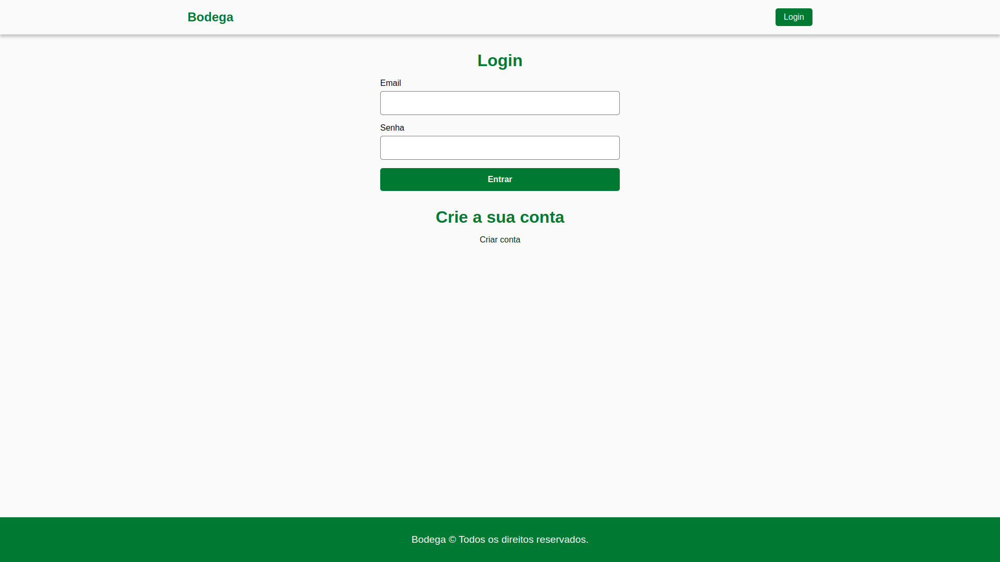

## Bodega version-1.0

### Sobre

Este projeto consiste em uma simulação de um **e-commerce** básico, permitindo que os usuários visualizem e adquiram produtos de forma eficiente. A aplicação incorpora um sistema de login, no qual os usuários são autenticados por meio de **JSON Web Tokens (JWT)**, garantindo um ambiente seguro e controlado para navegação. A proteção das senhas dos usuários é realizada com **bcrypt**, adicionando uma camada adicional de segurança.

O back-end é desenvolvido em **Node.js**, proporcionando uma arquitetura robusta e escalável. Além disso, os usuários têm a capacidade de consultar seu histórico de pedidos, oferecendo uma experiência de compra online completa. O projeto visa demonstrar o desenvolvimento de um sistema interativo e seguro, utilizando **JavaScript** e **React**, com a implementação de boas práticas de autenticação, criptografia e exibição dinâmica de dados.

### Tecnologias

- **JavaScript**: Linguagem de programação utilizada no projeto.
- **React**: Biblioteca JavaScript para criação de interfaces de usuário.
- **HTML**: Linguagem de marcação utilizada para estruturar as páginas do projeto.
- **CSS**: Linguagem de estilos utilizada para a estilização da interface.

### Requisitos

- NPM na versão 10.9 ou superior.

### Como instalar?

1. Faça o clone do projeto.
2. Abra o terminal e navegue até a pasta do projeto.
3. Faça uma cópia do arquivo **.env.example**: `cp .env.example .env`.
4. Edite o arquivo **.env** com os valores apropriados para o seu ambiente.
5. Instale as dependências usando o comando: `npm install`.
6. Inicie o servidor localmente com o comando: `npm run dev`.

### Back-end do Projeto

Este projeto possui um Back-end desenvolvido para fornecer os dados e funcionalidades necessárias para o funcionamento desta aplicação. Você pode acessá-lo no repositório:
[Acesse o repositório do Back-end](https://github.com/lucasrochabz/bodega-api)

### Encontrou algum problema?

Abra uma [issue](https://github.com/lucasrochabz/bodega/issues) com sua sugestão ou crítica.
