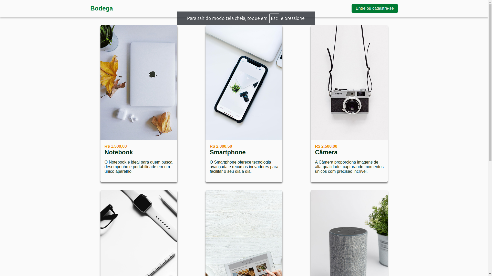
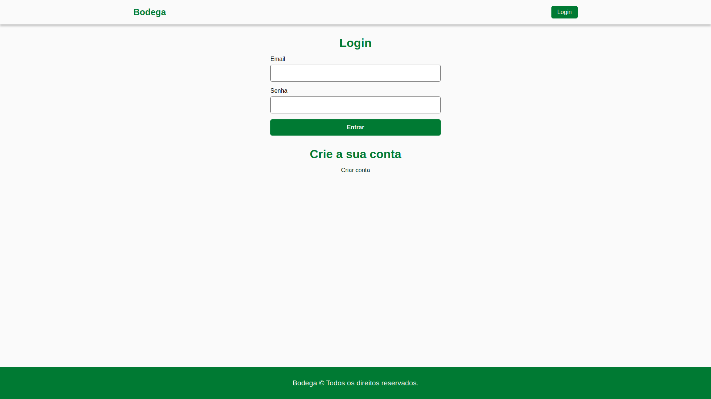

## Bodega





### Sobre

Este projeto é uma simulação de **e-commerce** desenvolvida em **JavaScript** com **React**, oferecendo uma navegação fluida com **React Router** e consumo da API do [Bodega API](https://github.com/lucasrochabz/bodega-api) para exibição de produtos, compras e histórico de pedidos. Conta com páginas de login e criação de cadastro, garantindo acesso seguro à plataforma.

O back-end, em **Node.js** com **Express**, utiliza **JSON Web Tokens (JWT)** para autenticação, **bcrypt** para criptografia de senhas e **MySQL** para armazenamento de dados.

A aplicação segue boas práticas de desenvolvimento, garantindo uma experiência moderna, segura e eficiente.

| Característica          | Descrição              |
| ----------------------- | ---------------------- |
| Tipo de aplicação       | SPA                    |
| Stack                   | React + Vite           |
| Estilo arquitetural     | Baseada em componentes |
| Gerenciamento de estado | Client-Side State      |
| Plataforma de execução  | Vercel                 |

### Funcionalidades

- [x] Autenticação com JWT
- [x] Cadastro e login de usuários
- [x] Listagem de produtos
- [x] Visualização de detalhes do produto
- [x] Histórico de pedidos
- [x] Rotas privadas protegidas
- [x] Internacionalização (i18n)

### Preview

Acesse o projeto online:
https://bodegashop.vercel.app/

### Tecnologias

| Tecnologia   | Descrição                |
| ------------ | ------------------------ |
| JavaScript   | Linguagem de programação |
| React        | Biblioteca de UI         |
| React Router | Rotas na aplicação       |
| Vite         | Build tool               |
| HTML         | Estrutura de páginas     |
| CSS Modules  | Estilos modulares        |

### Requisitos

- Node na versão 22.12 ou superior
- NPM na versão 10.9 ou superior.

### Como instalar?

1. Faça o clone do projeto.
2. Abra o terminal e navegue até a pasta do projeto.
3. Faça uma cópia do arquivo **.env.example**:
   ```bash
   cp .env.example .env
   ```
4. Edite o arquivo **.env** com os valores apropriados para o seu ambiente.
5. Instale as dependências usando o comando:
   ```bash
   npm install
   ```
6. Inicie o servidor localmente com o comando:
   ```bash
   npm run dev
   ```

### Estrutura do projeto

```bash
bodega/
├── cypress/
├── public/
├── src/
│   ├── assets/
│   ├── components/
│   │   ├── auth/
│   │   ├── forms/
│   │   ├── layout/
│   │   ├── shared/
│   │   └── ui/
│   │       └── MyComponent/
│   │           ├── MyComponent.jsx
│   │           ├── MyComponent.module.css
│   │           └── index.js
│   │
│   ├── config/
│   ├── constants/
│   │   ├── languages.js
│   │   ├── links.js
│   │   ├── roles.js
│   │   ├── routes.js
│   │   └── storageKeys.js
│   │
│   ├── contexts/
│   │   ├── AuthContext.js
│   │   ├── AuthProvider.jsx
│   │   ├── useAuth.js
│   │   ├── ToastContext.js
│   │   ├── ToastProvider.jsx
│   │   ├── UserContext.js
│   │   └── UserProvider.jsx
│   │
│   ├── hooks/
│   │   ├── auth/
│   │   ├── orders/
│   │   ├── payments/
│   │   ├── products/
│   │   ├── shared/
│   │   └── index.js
│   │
│   ├── i18n/
│   │   ├── locales/
│   │   └── index.js
│   │
│   ├── pages/
│   │   ├── HomePage/
│   │   ├── NotFoundPage/
│   │   ├── admin/
│   │   └── auth/
│   │   │   └── LoginPage/
│   │   │       ├── LoginPage.jsx
│   │   │       └── LoginPage.module.css
│   │   │
│   │   ├── orders/
│   │   ├── products/
│   │   └── users/
│   │
│   ├── routes/
│   │   ├── private/
│   │   ├── public/
│   │   └── app.routes.jsx
│   │
│   ├── schemas/
│   ├── services/
│   │   └── http/
│   │       ├── client.js
│   │       └── request.js
│   │
│   ├── styles/
│   │   ├── animations/
│   │   ├── colors/
│   │   └── global.css
│   │
│   ├── types/
│   ├── utils/
│   ├── App.jsx
│   └── main.jsx
│
├── .env.example
├── .gitignore
├── cypress.config.js
├── eslint.config.js
├── index.html
├── jsconfig.json
├── package-lock.json
├── package.json
├── README.md
├── vercel.json
└── vite.config.js
```

### Back-end do Projeto

Este projeto possui um Back-end desenvolvido para fornecer os dados e funcionalidades necessárias para o funcionamento desta aplicação. Você pode acessá-lo no repositório:
[Acesse o repositório do Back-end](https://github.com/lucasrochabz/bodega-api)

### Encontrou algum problema?

Abra uma [issue](https://github.com/lucasrochabz/bodega/issues) com sua sugestão ou crítica.
