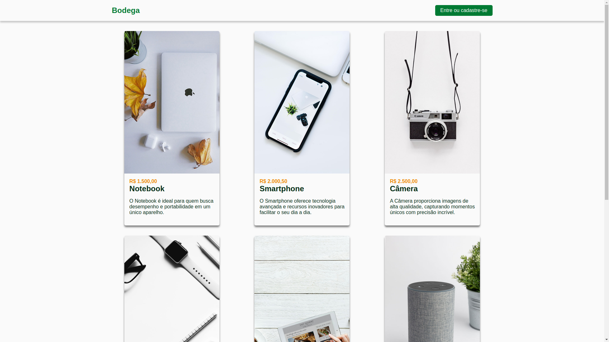
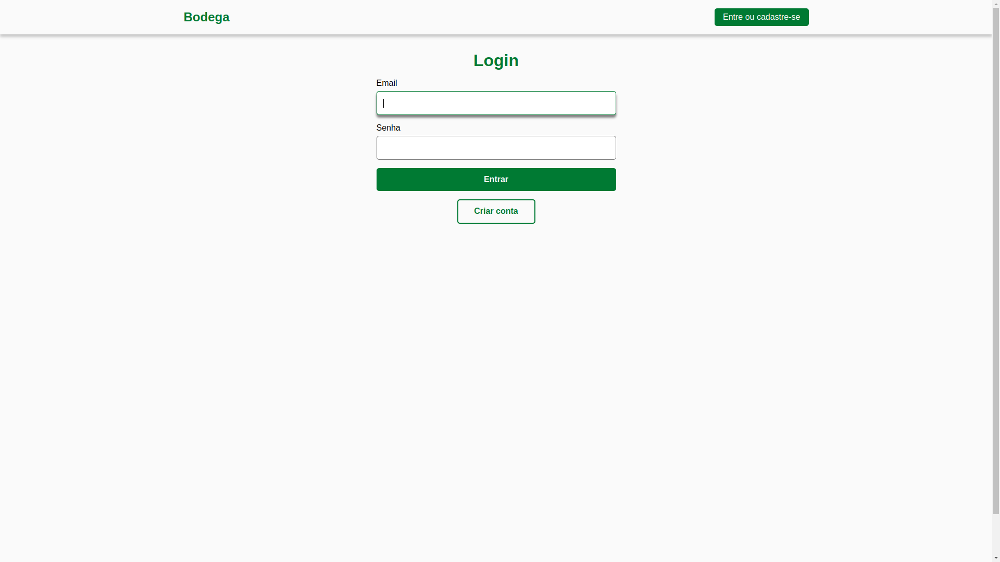

## Bodega




### Sobre

Este projeto é uma simulação de **e-commerce** desenvolvida em **JavaScript** com **React**, oferecendo uma navegação fluida com **React Router** e consumo da API do [Bodega API](https://github.com/lucasrochabz/bodega-api) para exibição de produtos, compras e histórico de pedidos. Conta com páginas de login e criação de cadastro, garantindo acesso seguro à plataforma.

O back-end, em **Node.js** com **Express**, utiliza **JSON Web Tokens (JWT)** para autenticação, **bcrypt** para criptografia de senhas e **MySQL** para armazenamento de dados.

A aplicação segue boas práticas de desenvolvimento, garantindo uma experiência moderna, segura e eficiente.

### Tecnologias

- **JavaScript**: Linguagem de programação utilizada no projeto.
- **React**: Biblioteca JavaScript para criação de interfaces de usuário.
- **React Router**: Gerenciamento de rotas na aplicação.
- **HTML**: Linguagem de marcação utilizada para estruturar as páginas do projeto.
- **CSS**: Linguagem de estilos utilizada para a estilização da interface.

### Requisitos

- Node na versão versão 22.12 ou superior
- NPM na versão 10.9 ou superior.

### Como instalar?

1. Faça o clone do projeto.
2. Abra o terminal e navegue até a pasta do projeto.
3. Faça uma cópia do arquivo **.env.example**:
   ```bash
   cp .env.example .env
   ```
4. Edite o arquivo **.env** com os valores apropriados para o seu ambiente.
5. Instale as dependências usando o comando:
   ```bash
   npm install
   ```
6. Inicie o servidor localmente com o comando:
   ```bash
   npm run dev
   ```

### Estrutura do projeto

```bash
bodega/
├── cypress/
├── public/
├── src/
│   ├── api/
│   ├── assets/
│   ├── components/
│   │   ├── auth/
│   │   ├── shared/
│   │   ├── forms/
│   │   ├── layout/
│   │   └── ui/
│   │       └── MyComponent/
│   │           ├── MyComponent.jsx
│   │           ├── MyComponent.module.css
│   │           └── index.js
│   │
│   ├── config/
│   ├── contexts/
│   ├── hooks/
│   │   ├── orders/
│   │   ├── payments/
│   │   ├── products/
│   │   ├── shared/
│   │   └── index.js
│   │
│   ├── http/
│   ├── i18n/
│   ├── pages/
│   │   ├── AdminPage/
│   │   └── auth/
│   │   │   ├── FolderPage/
│   │   │   └── index.js
│   │   │
│   │   ├── HomePage/
│   │   ├── NotFoundPage/
│   │   ├── orders/
│   │   ├── products/
│   │   ├── users/
│   │   └── index.js
│   │
│   ├── routes/
│   ├── services/
│   ├── styles/
│   │   ├── animations/
│   │   ├── colors/
│   │   └── global.css
│   │
│   ├── types/
│   ├── utils/
│   ├── App.jsx
│   └── main.jsx
│
├── .env.example
├── .gitignore
├── cypress.config.js
├── eslint.config.js
├── index.html
├── package-lock.json
├── package.json
├── README.md
├── vercel.json
└── vite.config.js
```

### Back-end do Projeto

Este projeto possui um Back-end desenvolvido para fornecer os dados e funcionalidades necessárias para o funcionamento desta aplicação. Você pode acessá-lo no repositório:
[Acesse o repositório do Back-end](https://github.com/lucasrochabz/bodega-api)

### Encontrou algum problema?

Abra uma [issue](https://github.com/lucasrochabz/bodega/issues) com sua sugestão ou crítica.
